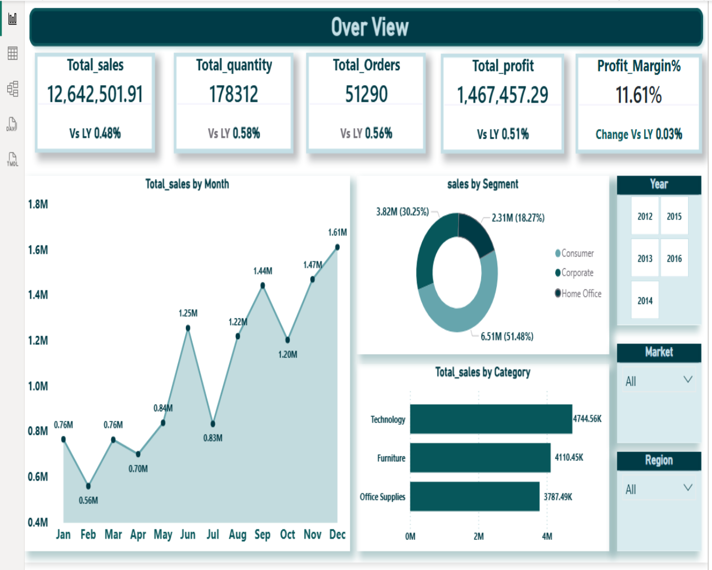
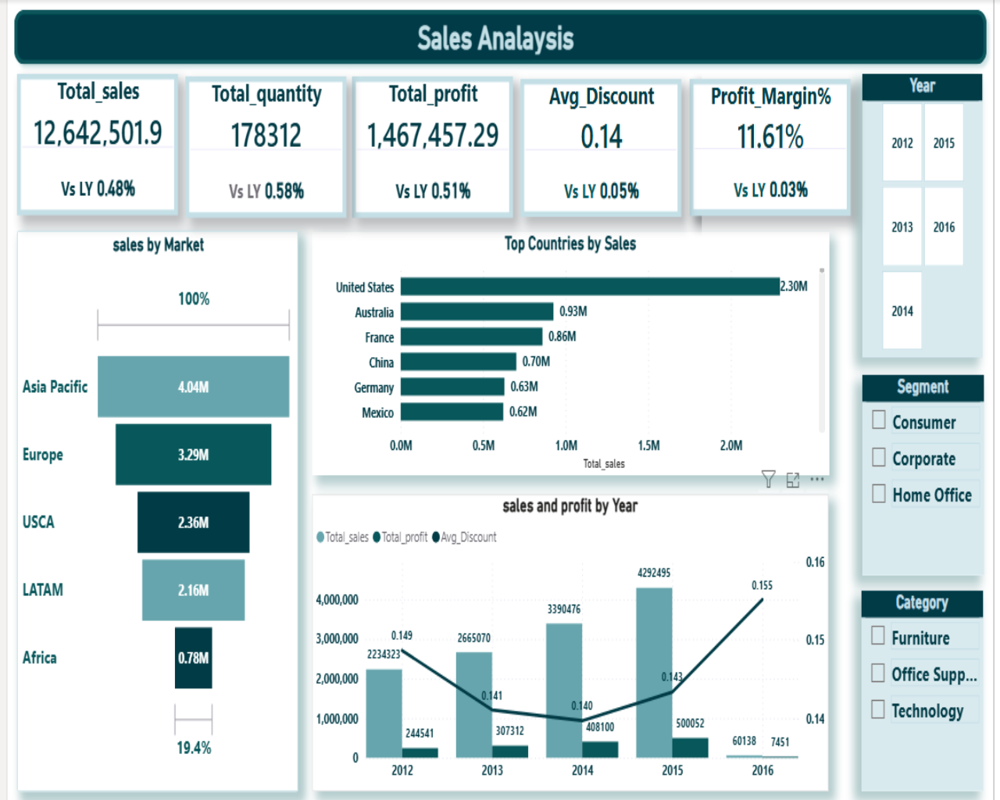
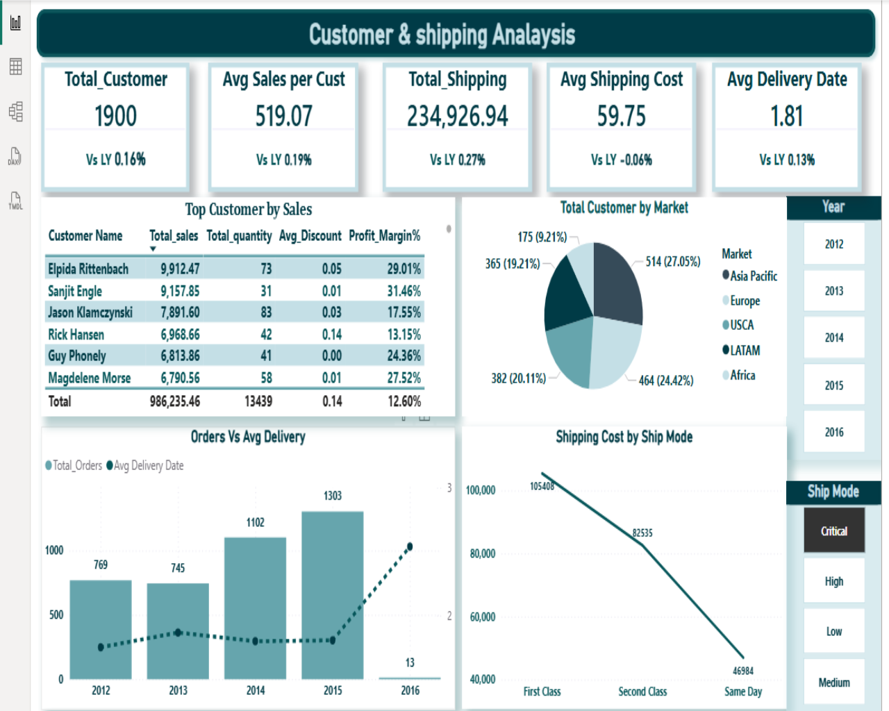
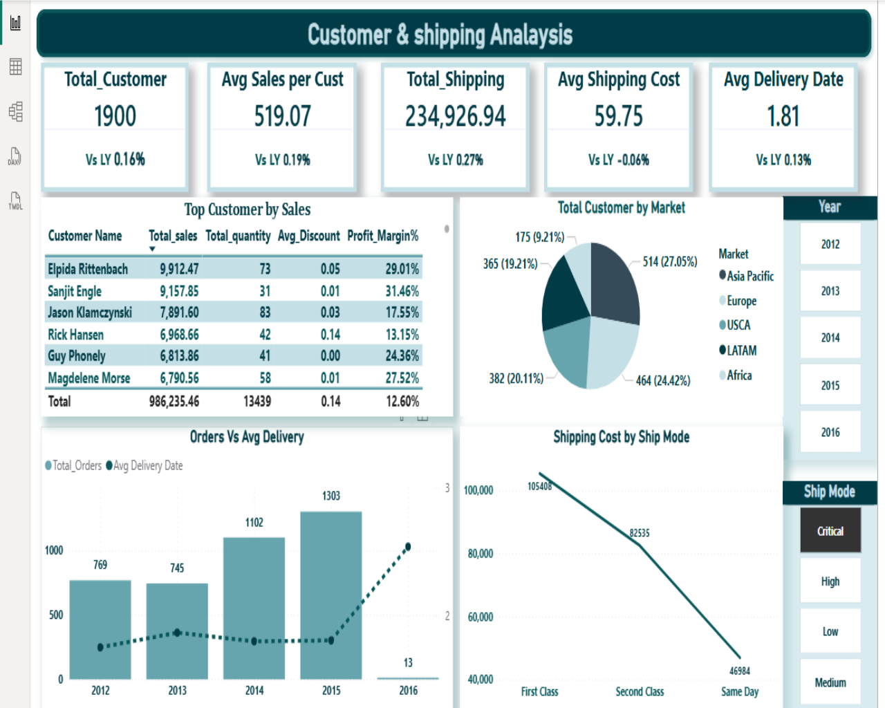

# 🌍 Global Store Sales Analysis Dashboard | Power BI

## 📌 Project Overview

This project presents an interactive Power BI dashboard developed to analyze global store sales performance, customer behavior, shipping efficiency, and product profitability. The dashboard provides valuable business insights to support data-driven decision-making and strategic planning.

---

## 🎯 Project Objectives

- Analyze overall business performance using key performance indicators (KPIs).
- Evaluate sales trends across regions and categories.
- Analyze customer purchasing behavior and shipping performance.
- Identify top-performing and underperforming products.
- Generate business insights to support strategic decisions.

---

## 🛠️ Tools & Technologies Used

- Microsoft Power BI
- Power Query
- DAX
- Data Modeling
- Data Visualization

---

## 📊 Key Performance Indicators (KPIs)

- Total Sales
- Total Profit
- Total Orders
- Profit Margin
- Customer Analysis
- Shipping Performance
- Product Performance

---

# 📈 Dashboard Visualizations

## 📊 Overview Dashboard

This dashboard provides a comprehensive overview of the company's overall business performance through key performance indicators (KPIs), including total sales, total profit, total orders, and business trends. It enables decision-makers to quickly assess company performance.

### Key Insight:
The business generated strong overall sales performance with significant variations across regions and categories.

---

## 💰 Sales Dashboard

This dashboard focuses on analyzing sales performance across regions, categories, and time periods. It helps identify top-performing markets, profitable categories, and sales trends over time.

### Key Insight:
Certain regions and product categories contributed significantly more to overall revenue and profitability.

---

## 🚚 Customer & Shipping Dashboard

This dashboard analyzes customer purchasing behavior and shipping operations. It provides insights into customer segments, shipping methods, delivery performance, and their impact on business outcomes.

### Key Insight:
Shipping efficiency and customer purchasing patterns directly influenced sales performance and customer satisfaction.

---

## 📦 Product Dashboard

This dashboard evaluates product performance by analyzing sales, profit, categories, and sub-categories. It helps identify top-selling products, profitable categories, and products requiring strategic attention.

### Key Insight:
Several products generated high sales but low profitability, highlighting opportunities for optimization.

---

## 📈 Business Insights

- Identified top-performing products and categories.
- Analyzed regional sales performance and profitability.
- Evaluated customer purchasing behavior.
- Assessed shipping efficiency and delivery performance.
- Generated actionable insights to support business decision-making.

---

## 📁 Files Included

- Full project_global store.pbix
- Dashboard screenshots
- README.md

---

## 🎯 Skills Demonstrated

- Data Cleaning
- Data Modeling
- DAX Calculations
- KPI Development
- Business Analysis
- Data Visualization
- Dashboard Design
- Storytelling with Data

---

## 👨‍💻 Author

**Mahmoud Gomaa**

Aspiring Data Analyst | SQL | Python | Power BI | Excel

📧 Open to Data Analyst opportunities and internships.
